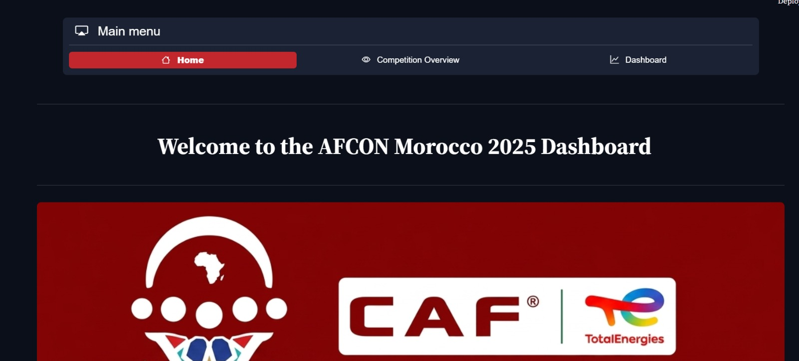
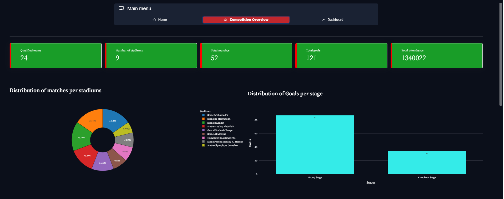

# AFCON-Morocco-2025-2026-Dashboard


## 📌 Project Description
This project involves designing an interactive dashboard that summarizes **Africa Cup of Nations (AFCON)** statistics and facilitates data analysis, as well as the understanding of the tournament’s key indicators.

---
## Dashboard overview




---


>>>>>>> a139b61 (Initial commit)

---

## 🚀 Features

The dashboard includes:

### 1) 🏠 Main Menu
Home page providing an introduction to the dashboard.

### 2) 📊 Competition Overview
Displays the key indicators of the competition, such as the total number of goals, number of matches, total attendance, and their distributions.

### 3) 📈 Main Dashboard
Composed of 3 analytical sections:

**⚽ Goals Analysis :** Goals distribution and offensive efficiency.


**🏆 Team Analysis :** Goals distribution by teams and disciplinary statistics.

**👤 Players Analysis :** Player statistics, including goals and assists ...


### 4) 🎛️ Sidebar
Allows filtering players by their names and positions.


---


## 🛠️ Technologies Used
- Python 🐍
- Pandas🐼: Data manipulation.
- Plotly📈: Data visualization.
- Streamlit📊: Dashboard development.

---

##  Project Installation

### 🔹 Copy the Repository Link
Copy the GitHub HTTPS link of the project:

```bash
https://github.com/mohamederrahmouni/AFCON-Morocco-2025-2026-Dashboard.git
```


---

### 🔹 Clone the Project
Open your terminal (CMD / PowerShell / Terminal) and run:

```bash
git clone https://github.com/mohamederrahmouni/AFCON-Morocco-2025-2026-Dashboard.git
```

### 🔹 Navigate to the Project Folder
```bash
cd project (project: the folder that contains the project)
```

### 🔹 Install Dependencies


```bash
pip install -r requirements.txt
```

### 🔹 Run the dashboard


```bash
streamlit run AFCON_Dashboard.py
<<<<<<< HEAD
```
=======
>>>>>>> a139b61 (Initial commit)
